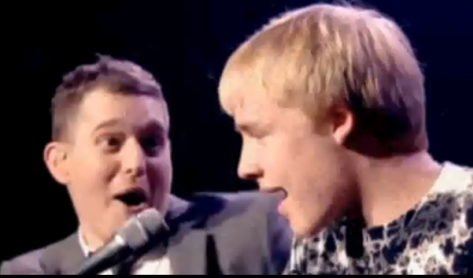

### I like it when celebrities bring civilians up on stage and let them sing

When I saw [a reddit thread where people were sharing their favorites of these](http://www.reddit.com/r/videos/comments/2d9bue/this_girl_will_never_ever_forget_this_moment/), I wanted to scoop them all up so I could watch them. And so I did. Here they are: 

<table><th>Link<th>Score<th>Comment from reddit thread<tr><td><a href=http://www.youtube.com/watch?v=Z-t4POnosio>link</a><td>472<td>Then there is this one</tr><tr><td><a href=https://www.youtube.com/watch?v=FTq-TQ3Sldc>link</a><td>379<td>I really like this one, it's also a little different.</tr><tr><td><a href=https://www.youtube.com/watch?v=xesAJfEe3mQ#t=20s>link</a><td>253<td>This clip is probably my favorite fan-on-stage clip. Dude crowd surfs to the front, gets let on stage, and plays bass for the entire song while looking totally natural. Too funny.</tr><tr><td><a href=http://youtu.be/zxLjtx8wukQ>link</a><td>207<td>Not singing, but same idea.  Edit: Original Vevo (Non-Potato Quality) http://youtu.be/htZnpnoHGgY</tr><tr><td><a href=http://youtu.be/PEUedr6ipPk?t=2m36s>link</a><td>204<td>Not singing, rapping, but this one gives me chills</tr><tr><td><a href=https://www.youtube.com/watch?v=a_QqfEYNRlc>link</a><td>200<td>Neither is this one.</tr><tr><td><a href=https://www.youtube.com/watch?v=jGy5eKKYiG0>link</a><td>193<td>I love this one!</tr><tr><td><a href=https://www.youtube.com/watch?v=OQobVuUxOuQ>link</a><td>153<td>What about this Hayley Williams vid?</tr><tr><td><a href=http://youtu.be/DPiG7HVt5lM>link</a><td>95<td>This is probably the most epic fan participation: Keith Moon Collapses at Cow Palace (condensed ver…:  TL/DW: Moon od's during concert, Townshend calls a random19 year old from the audience to finish the show</tr><tr><td><a href=http://m.youtube.com/watch?v=IgwkiF-zARM>link</a><td>72<td>This one's my favorite... Steel Panther pulls dude on stage, plays Hot for Teacher and totally fucking nails it.</tr><tr><td><a href=https://www.youtube.com/watch?v=uAzE5ssZddg>link</a><td>72<td>This is the best personally..</tr><tr><td><a href=https://www.youtube.com/watch?v=FpXm_sXcc_Y&t=132s>link</a><td>59<td>How about this one?</tr><tr><td><a href=https://www.youtube.com/watch?v=SBgZNINN6MU>link</a><td>58<td>This one is kinda the opposite, but i like it</tr><tr><td><a href=https://www.youtube.com/watch?v=rmv1VhrtYRo>link</a><td>58<td>This Karen chick got up on stage and kinda impressed the audience.</tr><tr><td><a href=https://www.youtube.com/watch?v=enHdvA4leCM>link</a><td>49<td>He appeared on the TV show 'The Voice' fairly recently</tr><tr><td><a href=http://youtu.be/PEUedr6ipPk?t=2m30s>link</a><td>31<td>Kid gets on stage with Kendrick Lamar and kills it.</tr><tr><td><a href=https://www.youtube.com/watch?v=B5eT6TaEtPI>link</a><td>25<td></tr><tr><td><a href=https://www.youtube.com/watch?v=Z2tmp4lIRgA>link</a><td>24<td>some more piano  Watch the intro and then skip to 7:30 minutes</tr><tr><td><a href=https://www.youtube.com/watch?v=6pKqK2WtsA4>link</a><td>24<td>Avenged Sevenfold does this as well</tr><tr><td><a href=http://youtu.be/7rLTC67ReLg>link</a><td>17<td>Jessie J - Price Tag (Live Glastonbury 2011).FLV:</tr><tr><td><a href=https://www.youtube.com/watch?v=AczIYDZqOCw>link</a><td>14<td>More Panther.  Seem like pretty cool guys.</tr><tr><td><a href=https://www.youtube.com/watch?v=o6TKpkY4WcM>link</a><td>11<td>Michael Buble did a similar thing and had a duet with a 15 year old:</tr><tr><td><a href=https://www.youtube.com/watch?v=Bceuh8c-4kg>link</a><td>10<td>My personal favorite video of random dude doing musical stuff with other more famous dude who does musical stuff</tr><tr><td><a href=http://www.youtube.com/watch?v=QX-xToQI34I>link</a><td>6<td>Not an interruption, but it's another fan duet for you :)</tr><tr><td><a href=https://www.youtube.com/watch?v=h4sJMcgeDe0>link</a><td>5<td>Kelly Clarkson singing Sweet Child of Mine (bonus [?] Yellowcard guy)</tr><tr><td><a href=http://youtu.be/2s7hkd_r9po>link</a><td>4<td>You should watch this</tr><tr><td><a href=https://www.youtube.com/watch?v=Dnc8lX1INvY>link</a><td>4<td>Paramore has done this exact thing many times over the years at their shows and there's a lot of footage of it, its pretty sweet. My favorite vid similar to this is when hayley takes someone's phone from the front row;</tr><tr><td><a href=https://www.youtube.com/watch?v=DPiG7HVt5lM>link</a><td>4<td>It all started with The Who</tr></table>

If you care to, you can see how I did this in this [ipython notebook](http://nbviewer.ipython.org/github/laurieskelly/lrs-bin/blob/master/holyshitballsmom/celeb-civilian-duets.ipynb)
