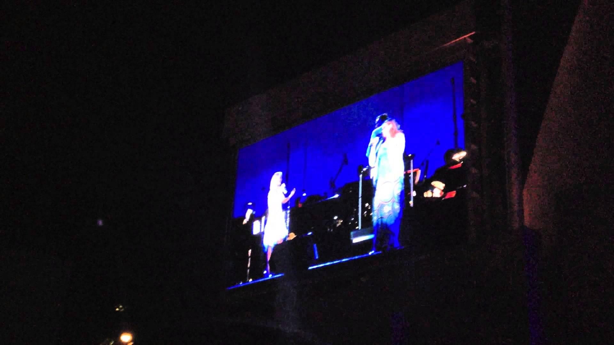

### I like it when celebrities bring civilians up on stage and let them sing

When I saw [a reddit thread where people were sharing their favorites of these](http://www.reddit.com/r/videos/comments/2d9bue/this_girl_will_never_ever_forget_this_moment/), I wanted to scoop them all up so I could watch them. And so I did. [update: Now with thumbnails and titles!]

<table><tr><td rowspan=2></td><td colspan=2><strong>Title: </strong>Michael Buble duets with 15 year old boy on 'This is Michael Buble' - HD </td></tr><tr><td style="width:150px"><strong>upvote score:</strong> 1567</td><td><strong>reddit comment:</strong> This is definitely one of them</td></tr><tr><td rowspan=2></td><td colspan=2><strong>Title: </strong>Josh Groban audience member surprise! -- Josh Page (Forte - Americas Got Talent) 2 years before! </td></tr><tr><td style="width:150px"><strong>upvote score:</strong> 472</td><td><strong>reddit comment:</strong> Then there is this one</td></tr><tr><td rowspan=2></td><td colspan=2><strong>Title: </strong>Me playing onstage with Steel Panther! </td></tr><tr><td style="width:150px"><strong>upvote score:</strong> 379</td><td><strong>reddit comment:</strong> I really like this one, it's also a little different.</td></tr><tr><td rowspan=2></td><td colspan=2><strong>Title: </strong>A Day To Remember - The Downfall Of Us All live @ ab Brussels HD </td></tr><tr><td style="width:150px"><strong>upvote score:</strong> 253</td><td><strong>reddit comment:</strong> This clip is probably my favorite fan-on-stage clip. Dude crowd surfs to the front, gets let on stage, and plays bass for the entire song while looking totally natural. Too funny.</td></tr><tr><td rowspan=2></td><td colspan=2><strong>Title: </strong>Michael Pollack Billy Joel </td></tr><tr><td style="width:150px"><strong>upvote score:</strong> 207</td><td><strong>reddit comment:</strong> Not singing, but same idea.  Edit: Original Vevo (Non-Potato Quality) http://youtu.be/htZnpnoHGgY</td></tr><tr><td rowspan=2></td><td colspan=2><strong>Title: </strong>Look Out For Detox Live in San Antonio - Kendrick Lamar & Kyle </td></tr><tr><td style="width:150px"><strong>upvote score:</strong> 204</td><td><strong>reddit comment:</strong> Not singing, rapping, but this one gives me chills</td></tr><tr><td rowspan=2></td><td colspan=2><strong>Title: </strong>Beyonce makes fan sing </td></tr><tr><td style="width:150px"><strong>upvote score:</strong> 200</td><td><strong>reddit comment:</strong> Neither is this one.</td></tr><tr><td rowspan=2></td><td colspan=2><strong>Title: </strong>FAN PLAYS STEEL PANTHER ONSTAGE WITH THE BAND </td></tr><tr><td style="width:150px"><strong>upvote score:</strong> 193</td><td><strong>reddit comment:</strong> I love this one!</td></tr><tr><td rowspan=2></td><td colspan=2><strong>Title: </strong>Hayley & I - Ignorance (acoustic) </td></tr><tr><td style="width:150px"><strong>upvote score:</strong> 153</td><td><strong>reddit comment:</strong> What about this Hayley Williams vid?</td></tr><tr><td rowspan=2></td><td colspan=2><strong>Title: </strong>Keith Moon Collapses at Cow Palace (condensed version) </td></tr><tr><td style="width:150px"><strong>upvote score:</strong> 95</td><td><strong>reddit comment:</strong> This is probably the most epic fan participation: Keith Moon Collapses at Cow Palace (condensed ver…:  TL/DW: Moon od's during concert, Townshend calls a random19 year old from the audience to finish the show</td></tr><tr><td rowspan=2></td><td colspan=2><strong>Title: </strong>STEEL PANTHER - HOT FOR TEACHER & IT WONT S**K ITSELF </td></tr><tr><td style="width:150px"><strong>upvote score:</strong> 72</td><td><strong>reddit comment:</strong> This one's my favorite... Steel Panther pulls dude on stage, plays Hot for Teacher and totally fucking nails it.</td></tr><tr><td rowspan=2></td><td colspan=2><strong>Title: </strong>Fan sings with Michael Buble at XL Center </td></tr><tr><td style="width:150px"><strong>upvote score:</strong> 72</td><td><strong>reddit comment:</strong> This is the best personally..</td></tr><tr><td rowspan=2></td><td colspan=2><strong>Title: </strong>For Good - Kristin Chenoweth & Sarah Horn - Hollywood Bowl </td></tr><tr><td style="width:150px"><strong>upvote score:</strong> 59</td><td><strong>reddit comment:</strong> How about this one?</td></tr><tr><td rowspan=2></td><td colspan=2><strong>Title: </strong>Lenny Kravitz crashes the VOP Choir in New Orleans for "Fly Away" </td></tr><tr><td style="width:150px"><strong>upvote score:</strong> 58</td><td><strong>reddit comment:</strong> This one is kinda the opposite, but i like it</td></tr><tr><td rowspan=2></td><td colspan=2><strong>Title: </strong>Undercover Karaoke with Jewel </td></tr><tr><td style="width:150px"><strong>upvote score:</strong> 58</td><td><strong>reddit comment:</strong> This Karen chick got up on stage and kinda impressed the audience.</td></tr><tr><td rowspan=2></td><td colspan=2><strong>Title: </strong>[FULL] Sam Hollyman - Your Song - The Voice UK Season 2 </td></tr><tr><td style="width:150px"><strong>upvote score:</strong> 49</td><td><strong>reddit comment:</strong> He appeared on the TV show 'The Voice' fairly recently</td></tr><tr><td rowspan=2></td><td colspan=2><strong>Title: </strong>Look Out For Detox Live in San Antonio - Kendrick Lamar & Kyle </td></tr><tr><td style="width:150px"><strong>upvote score:</strong> 31</td><td><strong>reddit comment:</strong> Kid gets on stage with Kendrick Lamar and kills it.</td></tr><tr><td rowspan=2></td><td colspan=2><strong>Title: </strong>Kendrick Lamar "LOOK OUT FOR DETOX" </td></tr><tr><td style="width:150px"><strong>upvote score:</strong> 25</td><td><strong>reddit comment:</strong> </td></tr><tr><td rowspan=2></td><td colspan=2><strong>Title: </strong>"Memories" from "Cats" played by David Tolley, 1st piano performance on Johnny Carson's Tonight Show </td></tr><tr><td style="width:150px"><strong>upvote score:</strong> 24</td><td><strong>reddit comment:</strong> some more piano  Watch the intro and then skip to 7:30 minutes</td></tr><tr><td rowspan=2></td><td colspan=2><strong>Title: </strong>Avenged Sevenfold lets fan play the drums - Second Heartbeat (Puerto Rico) </td></tr><tr><td style="width:150px"><strong>upvote score:</strong> 24</td><td><strong>reddit comment:</strong> Avenged Sevenfold does this as well</td></tr><tr><td rowspan=2></td><td colspan=2><strong>Title: </strong>Jessie J - Price Tag (Live Glastonbury 2011).FLV </td></tr><tr><td style="width:150px"><strong>upvote score:</strong> 17</td><td><strong>reddit comment:</strong> Jessie J - Price Tag (Live Glastonbury 2011).FLV:</td></tr><tr><td rowspan=2></td><td colspan=2><strong>Title: </strong>***Explicit*** 11 year old Aidan Fisher with Steel Panther </td></tr><tr><td style="width:150px"><strong>upvote score:</strong> 14</td><td><strong>reddit comment:</strong> More Panther.  Seem like pretty cool guys.</td></tr><tr><td rowspan=2></td><td colspan=2><strong>Title: </strong>Michael Buble duets with 15 year old boy on 'This is Michael Buble' - HD </td></tr><tr><td style="width:150px"><strong>upvote score:</strong> 11</td><td><strong>reddit comment:</strong> Michael Buble did a similar thing and had a duet with a 15 year old:</td></tr><tr><td rowspan=2></td><td colspan=2><strong>Title: </strong>Vanderbilt Student Requests Playing For BILLY JOEL The Music And Song Incredible! </td></tr><tr><td style="width:150px"><strong>upvote score:</strong> 10</td><td><strong>reddit comment:</strong> My personal favorite video of random dude doing musical stuff with other more famous dude who does musical stuff</td></tr><tr><td rowspan=2></td><td colspan=2><strong>Title: </strong>Katy Perry, Jodi DiPiazza Sing at Night of Too Many Stars </td></tr><tr><td style="width:150px"><strong>upvote score:</strong> 6</td><td><strong>reddit comment:</strong> Not an interruption, but it's another fan duet for you :)</td></tr><tr><td rowspan=2></td><td colspan=2><strong>Title: </strong>Kelly Clarkson joins Metal Skool w/ her friend Jack Daniels </td></tr><tr><td style="width:150px"><strong>upvote score:</strong> 5</td><td><strong>reddit comment:</strong> Kelly Clarkson singing Sweet Child of Mine (bonus [?] Yellowcard guy)</td></tr><tr><td rowspan=2></td><td colspan=2><strong>Title: </strong>The Graham Norton Show - S11E11 -will.i.am, Miriam Margolyes, Greg Davies and Adam Lambert </td></tr><tr><td style="width:150px"><strong>upvote score:</strong> 4</td><td><strong>reddit comment:</strong> You should watch this</td></tr><tr><td rowspan=2></td><td colspan=2><strong>Title: </strong>Keith Moon Collapses at Cow Palace (condensed version) </td></tr><tr><td style="width:150px"><strong>upvote score:</strong> 4</td><td><strong>reddit comment:</strong> It all started with The Who</td></tr><tr><td rowspan=2></td><td colspan=2><strong>Title: </strong>Paramore Columbus ohio 5/3/10 hayley takes my camera! </td></tr><tr><td style="width:150px"><strong>upvote score:</strong> 4</td><td><strong>reddit comment:</strong> Paramore has done this exact thing many times over the years at their shows and there's a lot of footage of it, its pretty sweet. My favorite vid similar to this is when hayley takes someone's phone from the front row;</td></tr></table>

If you care to, you can see how I did this in this [ipython notebook](http://nbviewer.ipython.org/github/laurieskelly/lrs-bin/blob/master/holyshitballsmom/celeb-civilian-duets.ipynb)(and this [follow up](http://nbviewer.ipython.org/github/laurieskelly/lrs-bin/blob/master/holyshitballsmom/celeb-civilian-duets-youtube.ipynb) that includes the thumbnails and titles from youtube. 
