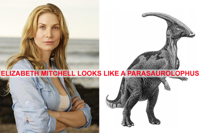

##this nonsense is a letter to the editor that appears on mcsweeneys.net, [here](http://www.mcsweeneys.net/articles/letters-from-2011)

Date: Thursday, 27 Oct 2011 
From: L. Skelly 
Subject: What do I do with this?

Dear McSweeney’s,

I think this thought every time I see the actress Elizabeth Mitchell: she looks like a parasaurolophus. Then one afternoon when I was bored, I stopped working on my very important doctoral thesis and opened Photoshop. I did a few Google image searches and then I made this:

All of this happened several months ago.

Now it’s just sitting there in My Pictures, staring at me, reminding me how weird I am.

I will probably just leave it there unless something happens involving Elizabeth Mitchell (other than her death of course), which would make it relevant. But that really doesn’t make it any less weird that I made it or have it. I actually now hope that she fades quietly into obscurity, so that a situation won’t arise where I am tempted to post it to my Facebook or reddit, and then have to answer the questions that might follow. Questions like, “Why did you make this?” Or, “Are you angry at Elizabeth Mitchell?” Or, “Why is the font so hostile and red?”

The only redeeming thing is that every time I look at it I get to think, <em>Yes. I was right. She does rather resemble that species of dinosaur.</em> It’s odd how satisfying it is just to see them side-by-side and compare the similarities. I enjoy wondering just how many people might agree with me and how many might disagree. Maybe some would assume I picked that dinosaur to imply something about the size of her forehead, and wouldn’t even notice the real similarities that I see: the double S-shaped shadow on the cheek; the angle of the eyebrow; the flared nostrils; and most of all the flat, wide pout. These features, the pout in particular, are even more prominent in her dynamic expressions when she is acting.

I’m confident that these similarities are real and not just a product of my imagination. I’m confident that someone who knows what they are talking about would look at the elements I describe and say that they are actually similar in some scientific way. What I’m not sure about is whether, for other people, these things combine to make a strong and cohesive impression, as they do in me. Do other people watch <em>Lost</em>, or <em>V</em>, or certain episodes of <em>ER</em>, and get the impression that they are watching the miracle of a part-human, part-parasaurolophus actress? Will they now, once I have pointed it out? Or will they just shrug and say, “Well, I guess I see the similarities. Sort of. Well, not really.”

Maybe that’s the reason behind the bright red font. Strong and official, meant to reassure the only person who should ever, ever see this: myself.

— Laurie
