# SRCCON 2016 presenters 

---

### Katie Park

#### session(s): [A data analysis of ourselves ¶](http://srccon.org/sessions/#proposal-318592)

[@katiepark](https://twitter.com/katiepark), DC

website: [None](None) 

Code + graphics at @nprviz, previously @postgraphics. Tampa-raised. Guitar/vox @hemlinesband + @badmovesdc. 

 --- 

###  ☔️ Aaron Williams  ☔️

#### session(s): [A data analysis of ourselves ¶](http://srccon.org/sessions/#proposal-318592)

[@aboutaaron](https://twitter.com/aboutaaron), Washington, DC

website: [https://www.acwx.net/2015/12/03/ive-changed-a-lot/](https://www.acwx.net/2015/12/03/ive-changed-a-lot/) 

(☞ ͡° ͜ʖ ͡°)☞ Reporter @postgraphics  Hacker @CACivicDataaaron.williams@washpost.com. always willing to help. email me. 

 --- 

### Joanna S. Kao

#### session(s): [Accessibility in media ¶](http://srccon.org/sessions/#proposal-318685)

[@joannaskao](https://twitter.com/joannaskao), New York, NY

website: [http://www.joannaskao.com](http://www.joannaskao.com) 

@FT dataviz journalist, @MIT '13 CS grad, formerly @ajam, @thetech, @BostonGlobe. Tweeting @BroadwayData for fun. PGP 0x81CFC062 

 --- 

### Joel Eastwood

#### session(s): [Balancing mental health in the newsroom ¶](http://srccon.org/sessions/#proposal-318365)

[@JoelEastwood](https://twitter.com/JoelEastwood), New York, NY

website: [http://joeleastwood.ca/](http://joeleastwood.ca/) 

Loitering at the intersection of journalism, code, data and graphics for @WSJ. Canadian. joel.eastwood@wsj.com 

 --- 

### Emma Carew Grovum

#### session(s): [Balancing mental health in the newsroom ¶](http://srccon.org/sessions/#proposal-318365)

[@emmacarew](https://twitter.com/emmacarew), New York, NY

website: [http://www.emmacarewgrovum.com](http://www.emmacarewgrovum.com) 

Asst. Managing Editor @thedailybeast | cofounder @DiversifyJourn #mediadiversity | member @ONA @AAJA @techladymafia | Married to @jgrovum 

 --- 

### Brian J. Brennan

#### session(s): [Beyond console.log: making the most of your developer tools ¶](http://srccon.org/sessions/#proposal-317448)

[@brianloveswords](https://twitter.com/brianloveswords), Brooklyn, NY

website: [https://www.linkedin.com/pub/brian-j-brennan/20/28a/4a9](https://www.linkedin.com/pub/brian-j-brennan/20/28a/4a9) 

chief garbage monster @Bocoup; figurehead @brooklyn_js; probably not three cats in a trench coat. He/him 

 --- 

### Sarah Moughty

#### session(s): [Break Down that Wall: Why Editorial and Audience Development Need to Work Together](http://srccon.org/sessions/#proposal-318639)

[@smoughts](https://twitter.com/smoughts), 

website: [http://www.pbs.org/frontline](http://www.pbs.org/frontline) 

Managing editor, digital @frontlinepbs. Smoking them all with intellect & savoir-faire. 

 --- 

### Pamela Johnston

#### session(s): [Break Down that Wall: Why Editorial and Audience Development Need to Work Together](http://srccon.org/sessions/#proposal-318639)

[@PamJohnston](https://twitter.com/PamJohnston), Boston

website: [http://www.pbs.org/frontline/](http://www.pbs.org/frontline/) 

Sr. director of audience development @FRONTLINEpbs Stay Smart. Watch #FRONTLINEpbs. And of course, listen to @Springsteen. 

 --- 

### Thomas Wilburn

#### session(s): [Building news apps for humanity ¶](http://srccon.org/sessions/#proposal-312019)

[@thomaswilburn](https://twitter.com/thomaswilburn), Seattle, WA

website: [http://thomaswilburn.net](http://thomaswilburn.net) 

Small-batch, artisanal data journalism for @seattletimes. West Coast operations for @urbanartistry. PGP key: https://keybase.io/thomaswilburn  | 0xFAAEB7148B00EDC2 

 --- 

### Kate Schimel

#### session(s): [Can We Pair Program The News? ¶](http://srccon.org/sessions/#proposal-318666)

[@kateschimel](https://twitter.com/kateschimel), Seattle, WA

website: [http://kateschimel.com](http://kateschimel.com) 

Assistant editor @highcountrynews. I write about education/climate/communities. Transparency nut/skier/mtn trudger. Tell me what matters most to you. 

 --- 

### Jordan Wirfs-Brock

#### session(s): [Can We Pair Program The News? ¶](http://srccon.org/sessions/#proposal-318666)

[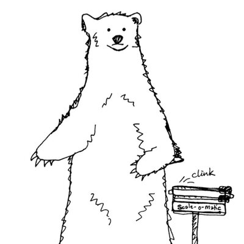](https://twitter.com/jordanwb)

[@jordanwb](https://twitter.com/jordanwb), Colorado, USA

website: [http://jordanwb.com](http://jordanwb.com) 

Data journalist/dataviz geek at @InsideEnergyNow, trail + relay running addict, brewer of beer, maker of maps, writer, champion eater of ice cream + sardines. 

 --- 

### Geoff Hing

#### session(s): [Data analysis N ways ¶](http://srccon.org/sessions/#proposal-318397)

[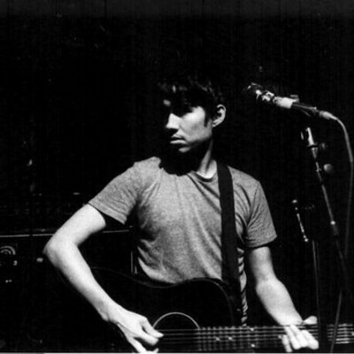](https://twitter.com/geoffhing)

[@geoffhing](https://twitter.com/geoffhing), Chicago, IL

website: [http://geoff.terrorware.com](http://geoff.terrorware.com) 

Midwestern cultural worker and technologist 

 --- 

### Stefan Wehrmeyer

#### session(s): [Data analysis N ways ¶](http://srccon.org/sessions/#proposal-318397)

[@stefanwehrmeyer](https://twitter.com/stefanwehrmeyer), Berlin

website: [http://stefanwehrmeyer.com](http://stefanwehrmeyer.com) 

http://Correctiv.org , FragDenStaat.de, OKFN.de 

 --- 

### Michael Corey

#### session(s): [Data sonification piano bar ¶](http://srccon.org/sessions/#proposal-318330)

[@mikejcorey](https://twitter.com/mikejcorey), Emeryville, California USA

website: [http://mikejcorey.com](http://mikejcorey.com) 

Senior News Applications Developer for @Reveal. I love mapping, data journalism and interface design. History = food = good. 

 --- 

### Neena Satija

#### session(s): [Data sonification piano bar ¶](http://srccon.org/sessions/#proposal-318330)

[@neenareports](https://twitter.com/neenareports), Austin, TX

website: [http://neenasatija.wordpress.com](http://neenasatija.wordpress.com) 

Investigative radio reporter and producer for @texastribune and @reveal (http://www.revealnews.org ). Recovering environmental reporter. 

 --- 

### Tara Adiseshan

#### session(s): [Designing Participatory Algorithmic Decision-Making Processes ¶](http://srccon.org/sessions/#proposal-318355)

[@taraadiseshan](https://twitter.com/taraadiseshan), 

website: [http://www.taraadiseshan.com](http://www.taraadiseshan.com) 

data science + visualization + UX + activism + digital privacy and security. past: @opennews fellow at @coralproject, @autodesk, @stanford. they/them 

 --- 

### Immigrant

#### session(s): [Designing Participatory Algorithmic Decision-Making Processes ¶](http://srccon.org/sessions/#proposal-318355)

[@hyper_linda](https://twitter.com/hyper_linda), Hackney, London

website: [http://lindasandvik.info/](http://lindasandvik.info/) 

~*creative technologist*~

Knight-Mozilla fellow 2015. Wannabe MacGyver. Rebel. 

 --- 

### Josh Laincz

#### session(s): [Designing brands at scale ¶](http://srccon.org/sessions/#proposal-318550)

[@zohf](https://twitter.com/zohf), Philadelphia-ish

website: [http://www.taco.design](http://www.taco.design) 

Designer, developer, dad.
Principal Designer @voxmediainc. 

 --- 

### Georgia Cowley

#### session(s): [Designing brands at scale ¶](http://srccon.org/sessions/#proposal-318550)

[@hellogeorgia](https://twitter.com/hellogeorgia), dc

website: [None](None) 

design director @voxmediainc. 

 --- 

### gboysun

#### session(s): [Every day I'm juggling: Managing managers, peer expectations, and your own project ideas ¶](http://srccon.org/sessions/#proposal-318061)

[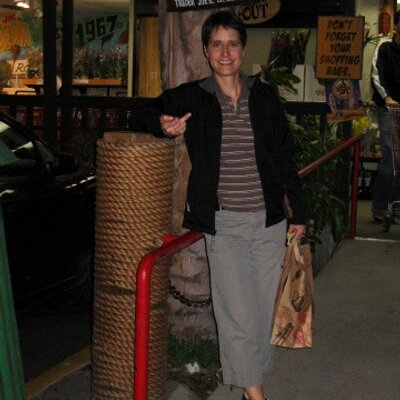](https://twitter.com/gboysun)

[@gboysun](https://twitter.com/gboysun), Spokane, WA

website: [None](None) 

Online developer by day. Wife and mom by morning, day and night. 

 --- 

### Justin Myers

#### session(s): [Every day I'm juggling: Managing managers, peer expectations, and your own project ideas ¶](http://srccon.org/sessions/#proposal-318061)

[@myersjustinc](https://twitter.com/myersjustinc), 

website: [http://www.justinmyers.net/](http://www.justinmyers.net/) 

Journalist, baker, programmer, crocheter. News automation editor @AP. Knows where his towel is. Married to @JuliaJRH. justin@justinmyers.net 

 --- 

### Jason Alcorn

#### session(s): [Expanding the Team: Parenthood in the News Business ¶](http://srccon.org/sessions/#proposal-318303)

[@jasonalcorn](https://twitter.com/jasonalcorn), Los Angeles

website: [http://jasalc.com](http://jasalc.com) 

consultant to newsrooms, foundations and nonprofits. building an informed citizenry. before: @invw @columbiajourn 

 --- 

### David Yee

#### session(s): [Get you a CMS that can do both: Platforms, the web, and storytelling imperatives ¶](http://srccon.org/sessions/#proposal-318698)

[@tangentialism](https://twitter.com/tangentialism), 

website: [http://tangentialism.com](http://tangentialism.com) 

Director of Platform Engineering at @voxmedia. 100% cheeseburger / ice cream. Tech team whisperer and moderate-to-semi-frequent museum-goer. 

 --- 

### Robin Kwong

#### session(s): 

[@RobinKwong](https://twitter.com/RobinKwong), London

website: [http://www.robinkwong.com](http://www.robinkwong.com) 

Special Projects Editor @FT bringing project management & design thinking into newsrooms. @ftdata alum. Former tech editor, reporter in Taiwan & HK. altMBA5 

 --- 

### Darius Kazemi

#### session(s): [Giffable Audio and the Social Web ¶](http://srccon.org/sessions/#proposal-318319)

[@tinysubversions](https://twitter.com/tinysubversions), Portland, OR

website: [http://tinysubversions.com](http://tinysubversions.com) 

I make weird internet art. Latest project: @glitchlogos! Glitching up corporate vector logos. Worker-owner at @feeltraincoop #WHNBM 

 --- 

### jane frie(n)dhoff

#### session(s): 

[@JFriedhoff](https://twitter.com/JFriedhoff), github.com/friej715

website: [http://janefriedhoff.com/](http://janefriedhoff.com/) 

riot grrl gamedev | creative researcher @The_O_C_R | alumna @nytimes | @slamcityoracles | @codeliberation | @DBAArcade | opinions don't represent my employer 

 --- 

### Julia Smith

#### session(s): [Give and Receive: Can we strengthen our community through remote mentorship and office hours? ¶](http://srccon.org/sessions/#proposal-318413)

[@julia67](https://twitter.com/julia67), Omaha, NE

website: [http://julia-smith.com](http://julia-smith.com) 

news+design+code for @INN, former @OpenNews fellow for @Reveal 

 --- 

### Kelsey Scherer

#### session(s): [How can teams build a consistent culture of documentation? ¶](http://srccon.org/sessions/#proposal-317439)

[@kelsa_](https://twitter.com/kelsa_), new york city

website: [http://www.kelseyscherer.com/](http://www.kelseyscherer.com/) 

senior designer @voxproduct / @voxmediainc 

 --- 

### Lauren Rabaino

#### session(s): [How can teams build a consistent culture of documentation? ¶](http://srccon.org/sessions/#proposal-317439)

[@laurenrabaino](https://twitter.com/laurenrabaino), New York City

website: [http://www.laurenrabaino.com](http://www.laurenrabaino.com) 

director of editorial products at @voxmediainc / @voxproduct. journalism + design + technology + revenue 

 --- 

### Neil Bedi

#### session(s): [How can we help save photojournalism? ¶](http://srccon.org/sessions/#proposal-318587)

[@_neilbedi](https://twitter.com/_neilbedi), New York, NY

website: [https://neilbedi.com](https://neilbedi.com) 

Developer experimenting with journalism. Former data editor, photo editor and reporter @dailybruin, @_thestack. 

 --- 

### Ariana Giorgi

#### session(s): [How can we peer review our data stories? ¶](http://srccon.org/sessions/#proposal-316702)

[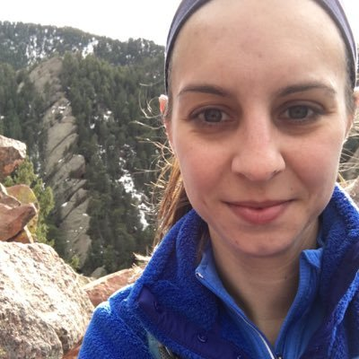](https://twitter.com/ArianaNGiorgi)

[@ArianaNGiorgi](https://twitter.com/ArianaNGiorgi), Washington, DC

website: [http://arianagiorgi.com](http://arianagiorgi.com) 

Data reporter/developer for @chrondata. Former graphics intern at @bizweekgraphics. Math enthusiast. 

 --- 

### Christine Zhang

#### session(s): [How can we peer review our data stories? ¶](http://srccon.org/sessions/#proposal-316702)

[@christinezhang](https://twitter.com/christinezhang), Los Angeles, CA

website: [https://plotswithchristine.wordpress.com/](https://plotswithchristine.wordpress.com/) 

@LATdatadesk @latimes @opennews. previously @BrookingsGlobal. i think (& tweet) for myself. email me: christine.zhang@latimes.com 

 --- 

### Bo Peng

#### session(s): [How do we convey technical ideas without dumbing things down? ¶](http://srccon.org/sessions/#proposal-315684)

[@bo_p](https://twitter.com/bo_p), Chicago, IL

website: [http://www.datascopeanalytics.com](http://www.datascopeanalytics.com) 

Partner & data scientist @DsAtweet, former @thisismetis instructor. I think/tweet about data, women in tech, Chicago, Canadianisms ... this set is incomplete. 

 --- 

### Justin Reese

#### session(s): [How to be a guest chef at someone's house party, or, Being a responsible embed provider ¶](http://srccon.org/sessions/#proposal-317747)

[@reefdog](https://twitter.com/reefdog), Dust/Texas

website: [http://justinreese.com/](http://justinreese.com/) 

@DocumentCloud. Plot mechanic. Lossily compressed. Still talking. Tweets reflect the values and opinions of The Coca-Cola Company. 

 --- 

### Arjuna Soriano

#### session(s): 

[@ArjunaSoriano](https://twitter.com/ArjunaSoriano), Los Angeles

website: [http://arjunasoriano.com](http://arjunasoriano.com) 

News developer for @marketplace, @medillschool alum and @habiarts member. 

 --- 

### Pietro

#### session(s): [How to craft compelling stories out of video interviews? ¶](http://srccon.org/sessions/#proposal-317919)

[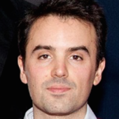](https://twitter.com/pietropassarell)

[@pietropassarell](https://twitter.com/pietropassarell), London

website: [http://www.pietropassarelli.com](http://www.pietropassarelli.com) 

Developer/Documentary film-maker. 'Video production and software development are converging'. http://times.github.io/quickQuote/  @opennews fellow @VoxProduct. 

 --- 

### Allison McCartney

#### session(s): [Illustrating Investigations: Creating compelling visuals for abstract stories ¶](http://srccon.org/sessions/#proposal-318582)

[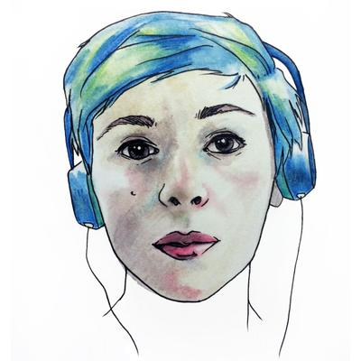](https://twitter.com/anmccartney)

[@anmccartney](https://twitter.com/anmccartney), San Francisco, CA

website: [None](None) 

Amateur shapeshifter. Currently at @BrownInstitute and @Reveal. 

 --- 

### Dolly

#### session(s): [Illustrating Investigations: Creating compelling visuals for abstract stories ¶](http://srccon.org/sessions/#proposal-318582)

[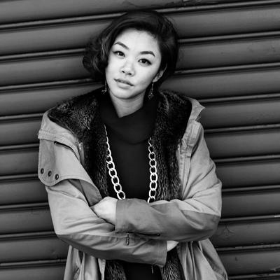](https://twitter.com/dollyli)

[@dollyli](https://twitter.com/dollyli), Oakland, CA

website: [http://dollyli.com](http://dollyli.com) 

visual journalist & illustrator. makin it rain charts, infogifs, and doodles at @ajplus & @ajplusespanol. 

 --- 

### gaba

#### session(s): [Install Party: The Coral Project ¶](http://srccon.org/sessions/#proposal-317495)

[@gaba](https://twitter.com/gaba), MVD - PDX - BAIRES

website: [http://gabrielarodriguez.org](http://gabrielarodriguez.org) 

programmer / queer / feminist / floss  / media / open data / security / spanglish - Software Developer at The Coral Project (Mozilla Foundation) 

 --- 

### jde

#### session(s): [Install Party: The Coral Project ¶](http://srccon.org/sessions/#proposal-317495)

[@daviderwin](https://twitter.com/daviderwin), New York City

website: [http://coralproject.net](http://coralproject.net) 

Working on @coralproject by day, kid trampoline by night, bass twanger for http://zindagiband.com  otherwise 

 --- 

### William Wolfe-Wylie

#### session(s): [Keeping people at the forefront of data stories ¶](http://srccon.org/sessions/#proposal-318535)

[@wolfewylie](https://twitter.com/wolfewylie), Canada

website: [http://www.wolfewylie.com](http://www.wolfewylie.com) 

I code internet @CBCNews, teach internet @CentennialJourn and @MunkSchool, mentor internet @learningCode, and ride my bike in Toronto. william@wolfewylie.com 

 --- 

### Erin Kissane

#### session(s): [Let's All Be Terrible at Things Together ¶](http://srccon.org/sessions/#proposal-318534)

[@kissane](https://twitter.com/kissane), Brooklyn, yes, hush.

website: [http://incisive.nu](http://incisive.nu) 

Working on code in journalism with @OpenNews + @Source + @SRCCON. Changing lanes. https://tinyletter.com/holdfast  

 --- 

### Ingrid Burrington

#### session(s): [Let's All Be Terrible at Things Together ¶](http://srccon.org/sessions/#proposal-318534)

[@lifewinning](https://twitter.com/lifewinning), A Small Island Near America

website: [http://lifewinning.com](http://lifewinning.com) 

Look, I'm just a person. Well, also a person with a book coming out in August. http://www.mhpbooks.com/books/networks-of-new-york/ … 

 --- 

### Sasha Koren

#### session(s): 

[@SashaK](https://twitter.com/SashaK), NYC

website: [http://bit.ly/1QhdwtQ](http://bit.ly/1QhdwtQ) 

Editor, @GdnMobileLab. Formerly: lots of digital news roles @nytimes Co-keeper of small domestic zoo. Uptowner. 

 --- 

### Alastair Coote

#### session(s): [News, mobile and privacy: Where’s the line between convenient and creepy? ¶](http://srccon.org/sessions/#proposal-318635)

[@_alastair](https://twitter.com/_alastair), New York, USA

website: [None](None) 

Doing stuff with code at @gdnmobilelab. Previously @nytimes. British born, living in New York (after some stops in Wales and Vancouver). PGP 0x65313bae21b0bb85 

 --- 

### Steph Yiu

#### session(s): [OMGWTFBBQ: Breaking news without breaking your site ¶](http://srccon.org/sessions/#proposal-318565)

[@crushgear](https://twitter.com/crushgear), Cambridge, MA

website: [http://stephyiu.com](http://stephyiu.com) 

Works at @WordPressVIP. Formerly @TestKitchen, Chicago Tribune @redeyechicago, @BostonGlobe. Medill grad. I make http://denizenmag.com  

 --- 

### Jeremy Bowers

#### session(s): [Open Sourcing And You ¶](http://srccon.org/sessions/#proposal-318023)

[@jeremybowers](https://twitter.com/jeremybowers), Washington, D.C.

website: [https://jeremybowers.com/](https://jeremybowers.com/) 

Elections, Congress, SCOTUS at @nytinteractive. Priors: @nprviz, @washingtonpost, @tb_times. Cook. Oenophile. #TheSqueezle, #TheGiblette & @beckybowers. 

 --- 

### dan sinker

#### session(s): [Peer Critique for News Nerds ¶](http://srccon.org/sessions/#proposal-318426)

[@dansinker](https://twitter.com/dansinker), Chicago

website: [http://dansinker.com](http://dansinker.com) 

I make stuff. Heading up the Knight-Mozilla OpenNews project, author of @MayorEmanuel, founder of Punk Planet magazine (RIP), Tacofancy, goat ambassador. 

 --- 

### scottpham

#### session(s): [Platform Constraints—When to Fight and When to Admit Defeat ¶](http://srccon.org/sessions/#proposal-318561)

[@scottpham](https://twitter.com/scottpham), California

website: [http://www.scottpham.com](http://www.scottpham.com) 

Digital journalist. Former Drone Guy. Podcast enthusiast. Data Journalist at @CIRonline 

 --- 

### Daniel Wood

#### session(s): 

[@DanielPWWood](https://twitter.com/DanielPWWood), Washington DC

website: [http://energy.gov/maps](http://energy.gov/maps) 

Maps and Charts @energy. Follower of Christ. Philly Native. 

 --- 

### Alan Palazzolo

#### session(s): [Playtime (in ludicrous speed) ¶](http://srccon.org/sessions/#proposal-317464)

[@zzolo](https://twitter.com/zzolo), Minneapolis, MN, USA

website: [http://zzolo.org](http://zzolo.org) 

Developer at WNYC, making the news visual and data-rich; MinnPost and Code for America alumn; lover of all things open source and free, especially the sky. 

 --- 

### Clarisa Diaz

#### session(s): 

[@Clarii_D](https://twitter.com/Clarii_D), 

website: [http://www.clarisadiaz.com](http://www.clarisadiaz.com) 

None 

 --- 

### Andrew Leimdorfer

#### session(s): 

[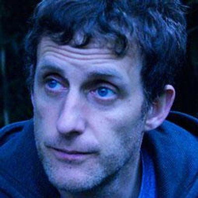](https://twitter.com/Leimdorfer)

[@Leimdorfer](https://twitter.com/Leimdorfer), London

website: [http://www.leimdorfer.co.uk](http://www.leimdorfer.co.uk) 

#Tottenham #BuenosAires #BBC #Media #Journalism #Data #Programming #Running #etc All opinion plagued by doubt 

 --- 

### Annie Daniel

#### session(s): [Running undergraduate internships that produce great newsroom developers ¶](http://srccon.org/sessions/#proposal-318203)

[@anieldaniel](https://twitter.com/anieldaniel), Austin

website: [http://annie-daniel.com](http://annie-daniel.com) 

Data & visuals developer at @TexasTribune. Aggressive tar heel. Rory Gilmore Jr. 80% glitter. 

 --- 

### Aram Zucker-Scharff

#### session(s): [Skipping the blame game and working across teams to fix newsroom Ad Tech ¶](http://srccon.org/sessions/#proposal-318653)

[@Chronotope](https://twitter.com/Chronotope), NYC, NY

website: [http://bit.ly/aram](http://bit.ly/aram) 

AramZS elsewhere. Narrative designer, digital tool-maker, obsessive reader. Developer w/ @salon, @pressfwd. Tech solutions for journalism problems. Made a font. 

 --- 

### Matt

#### session(s): [Sometimes I Sit and Think About Evergreen Content and Sometimes I Just Sit ¶](http://srccon.org/sessions/#proposal-318322)

[@mattdennewitz](https://twitter.com/mattdennewitz), Chicago

website: [http://tilde.club/~mdtz](http://tilde.club/~mdtz) 

vp product @pitchfork. i make @beergraphs, @saberarchive / https://ballsandstrikes.co . http://github.com/mattdennewitz . opinions mine. 

 --- 

### ᶘ ᵒ㉨ᵒᶅ

#### session(s): [Sometimes I Sit and Think About Evergreen Content and Sometimes I Just Sit ¶](http://srccon.org/sessions/#proposal-318322)

[@donohoe](https://twitter.com/donohoe), Brooklyn, NY

website: [http://donohoe.io](http://donohoe.io) 

Currently @newyorker Past-life @qz and @nytimes. Retweets suggest VC investments 

 --- 

### Gurman Bhatia

#### session(s): 

[@GurmanBhatia](https://twitter.com/GurmanBhatia), Dilli se Amreeka

website: [http://www.gurmanbhatia.com](http://www.gurmanbhatia.com) 

journalism + design + code. @journalsentinel. past: @pbpost, google j-fellow @Poynter, @columbiajourn. PGP: https://twitter.com/GurmanBhatia/status/644675725044416512 … gurmanbh@gmail.com 

 --- 

### Ted Han

#### session(s): [The Ecology of Newsroom Software ¶](http://srccon.org/sessions/#proposal-318576)

[@knowtheory](https://twitter.com/knowtheory), Oakland

website: [http://blog.knowtheory.net](http://blog.knowtheory.net) 

Leads @documentcloud engineering. Studied computational linguistics. Married to @crupar. Talks too much.
ricochet:xpizz2oatwtr2yr4
https://keybase.io/knowtheory  

 --- 

### Mike Tigas

#### session(s): [The Ecology of Newsroom Software ¶](http://srccon.org/sessions/#proposal-318576)

[@mtigas](https://twitter.com/mtigas), NYC via STL & GEG

website: [https://mike.tig.as/](https://mike.tig.as/) 

hacker-journo at @propublica | core @tabulaPDF dev | tor iOS dev (http://onionbrowser.com ) | @opennews alum | @spocats parent | 0xA993E7156E0E9923 

 --- 

### Sandhya Kambhampati

#### session(s): [The good and bad of newsroom on-boarding processes (and how can we make them better) ¶](http://srccon.org/sessions/#proposal-317007)

[@sandhya__k](https://twitter.com/sandhya__k), Berlin, Germany

website: [http://www.sandhyakambhampati.com](http://www.sandhyakambhampati.com) 

Knight-Mozilla @opennews fellow @Correctiv_org. Likes stats, public records & ice cream. Blog:http://bit.ly/1SvkY2m  PGP: http://bit.ly/1XcWkJb  

 --- 

### Lam Thuy Vo

#### session(s): [The good and bad of newsroom on-boarding processes (and how can we make them better) ¶](http://srccon.org/sessions/#proposal-317007)

[@lamthuyvo](https://twitter.com/lamthuyvo), New York, NY

website: [http://www.lamthuyvo.com](http://www.lamthuyvo.com) 

Data journalist/swiss army knife @WSJ Teach @cunyjschool. Previously @AJAM, @PlanetMoney. German-born Vietnamese nomad who makes web things | info@lamivo.com 

 --- 

### Kaeti Hinck

#### session(s): [They don’t want you to lead: Major keys to success as an underrepresented manager ¶](http://srccon.org/sessions/#proposal-318308)

[@kaeti](https://twitter.com/kaeti), Washington, DC

website: [https://www.washingtonpost.com/people/kaeti-hinck](https://www.washingtonpost.com/people/kaeti-hinck) 

Data editor with @postgraphics. By way of @INNnerds, @MinnData. I dig kind people, useful design, and breakfast sandwiches. Minnesotan in all the best ways. 

 --- 

### Emily Chow

#### session(s): [They don’t want you to lead: Major keys to success as an underrepresented manager ¶](http://srccon.org/sessions/#proposal-318308)

[@eschow](https://twitter.com/eschow), Washington, D.C.

website: [http://eschow.com](http://eschow.com) 

Designer, developer, visual storyteller. Also, knitter, baker and @citydogsrescue photographer. Find me outdoors. 

 --- 

### Julia Wolfe

#### session(s): [Threat Modeling for Code: When is Bad Code the Better Solution? ¶](http://srccon.org/sessions/#proposal-318449)

[@juruwolfe](https://twitter.com/juruwolfe), New York, NY

website: [http://juruwolfe.com](http://juruwolfe.com) 

News app developer @WSJ covering the election. Almost Canadian. Say hi: julia.wolfe@wsj.com 

 --- 

### Ivar Vong

#### session(s): [Threat Modeling for Code: When is Bad Code the Better Solution? ¶](http://srccon.org/sessions/#proposal-318449)

[@ivarvong](https://twitter.com/ivarvong), NYC

website: [https://instagram.com/ivarvong](https://instagram.com/ivarvong) 

tech/product at the @marshallproj. retired quadcopter pilot 

 --- 

### Joe Germuska

#### session(s): [Through an iPhone Darkly: Media and Networks through the lens of Science Fiction ¶](http://srccon.org/sessions/#proposal-317973)

[@JoeGermuska](https://twitter.com/JoeGermuska), Chicago, IL

website: [http://blog.germuska.com](http://blog.germuska.com) 

Chief Nerd @KnightLab • Project lead @CensusReporter • Host, Conference of the Birds, WNUR-FM •  Data Journalism • Civic Tech • Open Source 

 --- 

### Juan Elosua

#### session(s): [Tips and tricks: let's share our small time savers ¶](http://srccon.org/sessions/#proposal-318473)

[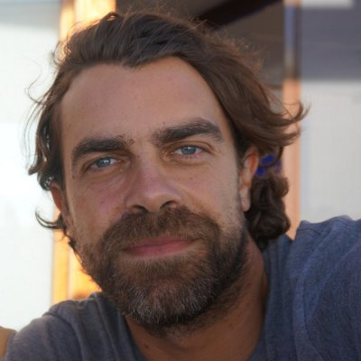](https://twitter.com/jjelosua)

[@jjelosua](https://twitter.com/jjelosua), Vigo, Spain

website: [http://www.juanelosua.com](http://www.juanelosua.com) 

Soon to be news apps developer @nprviz. Former Knight-Mozilla fellow @LNdata. Open Data enthusiast. 

 --- 

### Miguel Fiandor

#### session(s): [Tools to search millions of documents remotely and across borders ¶](http://srccon.org/sessions/#proposal-318531)

[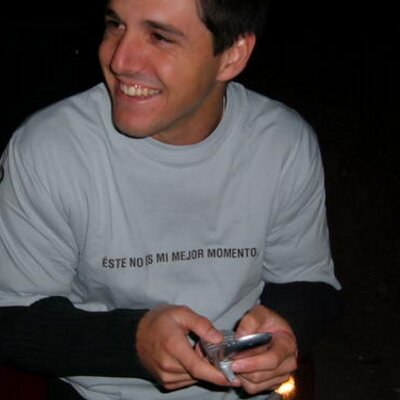](https://twitter.com/mfiandor)

[@mfiandor](https://twitter.com/mfiandor), Madrid

website: [http://transparenciadecuentaspublicas.es](http://transparenciadecuentaspublicas.es) 

Computer Engineer and Renewable Energy master. Interested in sustainability, open data, sports, energy, and traveling. 

 --- 

### Pamela Assogba

#### session(s): [True Life: I Work Remotely ¶](http://srccon.org/sessions/#proposal-318047)

[@pam_yam](https://twitter.com/pam_yam), DC area

website: [None](None) 

Coder @VoxProduct - Student - Teacher - Fashion Lover - Daydreamer - West Africaner (Benin - Togo - Senegal) 

 --- 

### Kavya Sukumar

#### session(s): 

[@kavyaSukumar](https://twitter.com/kavyaSukumar), Seattle, WA

website: [http://kavyasukumar.com](http://kavyasukumar.com) 

Developer with a journalism habit | 
Tinkers with storytelling tools  @voxproduct | 
Past: @opennews fellow, @pbpost, @medillschool, @microsoft, and @trichynit 

 --- 

### Dan Zajdband

#### session(s): [WebVR for the rest of us ¶](http://srccon.org/sessions/#proposal-317026)

[@impronunciable](https://twitter.com/impronunciable), New York, NY

website: [http://zajdband.com](http://zajdband.com) 

Psiconauta del inconsciente. 2016 Knight-Mozilla fellow at @coralproject / @nytimes / @washingtonpost 

 --- 

### AmyJo Brown

#### session(s): [What ideas can we borrow from the design world to solve news design problems? ¶](http://srccon.org/sessions/#proposal-318001)

[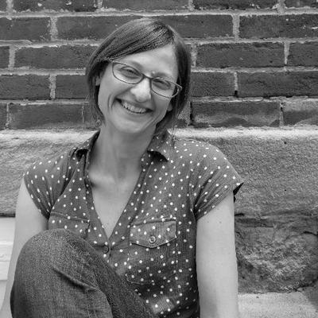](https://twitter.com/amyjo_brown)

[@amyjo_brown](https://twitter.com/amyjo_brown), Pittsburgh

website: [http://www.amyjobrown.com](http://www.amyjobrown.com) 

Reporter & editor. Work a lot with data, information design. Coffee addict. Urban gardener. Buried in history and public records. I code a little. I bake bread. 

 --- 

### Jennifer Thibault

#### session(s): [What ideas can we borrow from the design world to solve news design problems? ¶](http://srccon.org/sessions/#proposal-318001)

[@jlthibault](https://twitter.com/jlthibault), New York, NY

website: [http://jenniferthibault.com](http://jenniferthibault.com) 

Designing for The People, with @18F Better 'grammer than twitterer: http://instagram.com/jlthibault  

 --- 

### Evie Liu

#### session(s): [When is big data too big? When is less more? ¶](http://srccon.org/sessions/#proposal-318644)

[@Evie_xing](https://twitter.com/Evie_xing), Manhattan, NY

website: [None](None) 

Data journalist @NYDailyNews, former @KPCC @USCAnnenberg. Storyteller, data miner, web developer. LA my home, NY my playground. 

 --- 

### stevesuo

#### session(s): [When is big data too big? When is less more? ¶](http://srccon.org/sessions/#proposal-318644)

[@stevesuo](https://twitter.com/stevesuo), Portland, OR, USA

website: [http://www.oregonlive.com/data](http://www.oregonlive.com/data) 

Journalist, dad, nerd. Editor for investigative and data-driven enterprise @Oregonian. 

 --- 

### Chris Canipe

#### session(s): [Where Are the Midsize Metro News Developers ¶](http://srccon.org/sessions/#proposal-318313)

[@ccanipe](https://twitter.com/ccanipe), St. Louis, Missouri

website: [http://www.chriscanipe.com](http://www.chriscanipe.com) 

I make web things for The Wall Street Journal. I also teach a news apps class at Mizzou and play in a band called Malone. ... ... ... I'm okay. You? Cool cool. 

 --- 

### Jon McClure

#### session(s): [Where Are the Midsize Metro News Developers ¶](http://srccon.org/sessions/#proposal-318313)

[@JonRMcClure](https://twitter.com/JonRMcClure), Dallas, TX

website: [http://dallasnews.com](http://dallasnews.com) 

Data & news apps editor at @dallasnews. Formerly, hanger-on @TheDetailTV. Kann Deutsch beim Trinken. Kansas City native. 

 --- 

### Millie Tran

#### session(s): 

[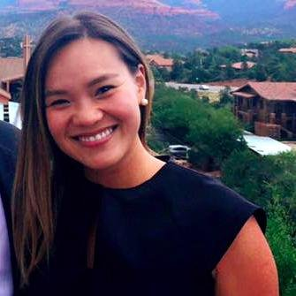](https://twitter.com/millie)

[@millie](https://twitter.com/millie), millie.tran@buzzfeed.com

website: [None](None) 

director of global adaptation @buzzfeed  likes to run toward wicked problems, build things, and systems. ‘there must be a better way’ — usually. 

 --- 

### stacy-marie ishmael

#### session(s): [Why your bot is nothing without a human ¶](http://srccon.org/sessions/#proposal-318651)

[@s_m_i](https://twitter.com/s_m_i), 

website: [None](None) 

#teamnewsapp #megateam @BuzzFeedNews #FTalumni #tiltalumni @ftalpha-villain @percolate-OG Trinidadian-at-large smi@buzzfeed.com. I will never be satisfied. 

 --- 

### Martin McClellan

#### session(s): [Working at the pace of Breaking News ¶](http://srccon.org/sessions/#proposal-318338)

[@hellbox](https://twitter.com/hellbox), Seattle

website: [http://martinmcclellan.com/](http://martinmcclellan.com/) 

Novelist, critic, and designer. Co-founder of @seattlereviewof, author of @cal4oclock, Senior UX designer for @breakingnews. 

 --- 

### Tiff Fehr

#### session(s): [Working at the pace of Breaking News ¶](http://srccon.org/sessions/#proposal-318338)

[@tiffehr](https://twitter.com/tiffehr), Greater New York

website: [http://tiffehr.com](http://tiffehr.com) 

The Inimitable Tiff.  Seattle-raised.
Data journalist/dev/asst. editor for @nytimes & @nytinteractive.
Probably following you via matryoshka-like Lists. 

 --- 

### David Yanofsky

#### session(s): [You want to teach a reporter to do what‽ ¶](http://srccon.org/sessions/#proposal-315520)

[@YAN0](https://twitter.com/YAN0), Palo Alto

website: [http://yanofsky.info](http://yanofsky.info) 

@qz | @quartzthings | Chartbuilder | @BloombrgNewsish | PGP: 159B 5596 7E1F D37B C966 773A A23B 423C FEDF C341 https://keybase.io/yanofsky  

 --- 

### Sarah Squire

#### session(s): [You want to teach a reporter to do what‽ ¶](http://srccon.org/sessions/#proposal-315520)

[@sarahjsquire](https://twitter.com/sarahjsquire), New York, NY

website: [http://Instagram.com/lolathescottie](http://Instagram.com/lolathescottie) 

Executive editor for data/graphics/viz at Dow Jones Media • PR for @lolathescottie • @michigandaily • Free food hunter • Currently hiring: sarah.squire@wsj.com 

 --- 

### Ryan Murphy

#### session(s): [You're The Reason My Name Is On Google: The Ethics Of Publishing Public Data ¶](http://srccon.org/sessions/#proposal-318629)

[@rdmurphy](https://twitter.com/rdmurphy), Austin, TX

website: [http://rdmurphy.org/](http://rdmurphy.org/) 

Reporter, @newsapps team lead + senior designer/developer with @TexasTribune. Campaign finance, data visualization, web performance and interactive design.  

 --- 

### Gideon Goldberg

#### session(s): 

[@GidsG](https://twitter.com/GidsG), London

website: [http://gidsgoldberg.com](http://gidsgoldberg.com) 

recovering former collector of tech swag. Software Engineer @guardian 

 --- 

